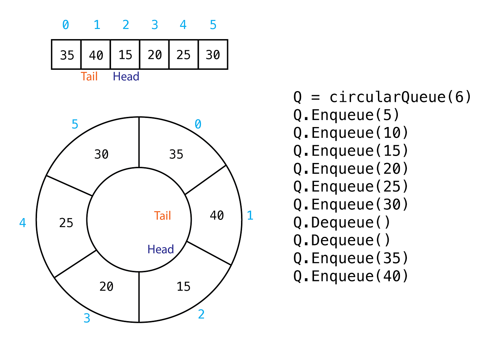

`Circular queues`, also known as `circular buffers or ring buffers`, are a type of queue data structure in which the rear and front pointers wrap around when they reach the end of the underlying array, forming a circular structure. Here are some key points and notes on circular queues:

1. **FIFO Principle**: Like a standard queue, circular queues follow the First-In-First-Out (FIFO) principle. The element that has been in the queue the longest is the first to be removed.

2. **Circular Structure**: Circular queues use a fixed-size array or buffer with rear and front pointers. When elements are dequeued from the front, the front pointer advances, and when elements are enqueued at the rear, the rear pointer advances. When these pointers reach the end of the array, they wrap around to the beginning.

3. **Efficient Use of Space**: Circular queues are useful in scenarios where you want to utilize memory efficiently. Since the queue "loops around," it can continue to store elements as long as there's space, without needing to shift elements in the array.

4. **Operations**:
   - `enqueue`: Adds an element to the rear of the queue. If the rear pointer reaches the end, it wraps around to the beginning.
   - `dequeue`: Removes and returns the element from the front of the queue. If the front pointer reaches the end, it wraps around to the beginning.
   - `isFull`: Checks if the queue is full, which occurs when the rear is one position behind the front.
   - `isEmpty`: Checks if the queue is empty, which occurs when the rear and front pointers are the same.

5. **Example Use Cases**:
   - Circular queues are commonly used in scenarios where you need to maintain a fixed-size history of data, such as in audio processing for real-time applications.
   - They are used in the implementation of low-level data structures like caches, memory buffers, and hardware data transfer.
   - In real-time systems and embedded systems, circular queues are used for managing data streams and event processing.

6. **Advantages**:
   - Efficient memory usage, as elements are stored in a fixed-size buffer.
   - Constant-time complexity for enqueue and dequeue operations.
   - Well-suited for scenarios with continuous data streams.

7. **Limitations**:
   - Fixed size: Circular queues have a maximum capacity determined by the size of the underlying array.
   - Overflows and underflows can occur if the capacity is exceeded or if dequeue operations are performed on an empty queue without checking.

8. **Implementation**: Implementing a circular queue can be done using an array with pointers for front and rear. Care must be taken to handle wraparound correctly.

9. **Circular Queue vs. Linear Queue**: Circular queues are more memory-efficient than linear queues when you have a fixed buffer size. In a linear queue, once the front and rear pointers reach the end, you'd need to shift elements to accommodate new ones, which is not required in a circular queue.

In summary, circular queues are a specialized type of queue that efficiently manages data in a circular manner. They are particularly useful in scenarios where you want to maintain a history of data or process continuous streams of information with a fixed-size buffer.