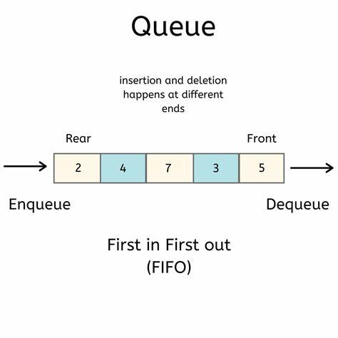

A queue is a fundamental data structure that follows the First-In-First-Out (FIFO) principle. It allows you to store and retrieve elements in a specific order, making it useful for tasks like managing tasks in a printer queue, scheduling processes, and solving various algorithmic problems. Here are details on the queue data structure and its operations, along with an implementation in JavaScript:

**Queue Data Structure**:



- A queue is a linear data structure that consists of a collection of elements.

- Elements are added at the rear (enqueue) and removed from the front (dequeue) of the queue.

- Queues are used to maintain a specific order for elements, with the first element added being the first to be removed.

**Common Queue Operations**:

1. **Creating a Queue**:

   To create a queue in JavaScript, you can use an array or create a custom data structure. Initialize an empty array to represent the queue.

   ```javascript
   const queue = [];
   ```

2. **Enqueue (Adding an Element)**:

   Use the `push()` method to add an element to the rear of the queue. This operation has a time complexity of O(1).

   ```javascript
   queue.push(5); // Adding 5 to the rear of the queue
   queue.push(10); // Adding 10 to the rear of the queue
   ```

3. **Dequeue (Removing and Returning an Element)**:

   Use the `shift()` method to remove and return the element from the front of the queue. This operation also has a time complexity of O(1).

   ```javascript
   const frontElement = queue.shift(); // Removing and returning the front element (5)
   ```

4. **Peek (Accessing the Front Element)**:

   To access the element at the front of the queue without removing it, you can use array indexing. This operation has a time complexity of O(1).

   ```javascript
   const frontElement = queue[0]; // Accessing the front element without removing it
   ```

5. **Checking if the Queue is Empty**:

   You can check if the queue is empty by examining its length or using a conditional statement. Checking for emptiness has a time complexity of O(1).

   ```javascript
   const isEmpty = queue.length === 0; // Checking if the queue is empty
   ```

**Queue Use Cases**:

- Queues are commonly used for tasks such as managing tasks in a printer queue, scheduling processes in operating systems, implementing breadth-first search algorithms in graphs, and handling requests in web servers.

**Example: Using a Queue to Implement a Breadth-First Search (BFS)**:

Here's a simple example of using a queue to implement a breadth-first search in a graph:

```javascript
class Queue {
  constructor() {
    this.items = [];
  }

  enqueue(item) {
    this.items.push(item);
  }

  dequeue() {
    return this.items.shift();
  }

  isEmpty() {
    return this.items.length === 0;
  }
}

function bfs(graph, startNode) {
  const visited = new Set();
  const queue = new Queue();

  visited.add(startNode);
  queue.enqueue(startNode);

  while (!queue.isEmpty()) {
    const node = queue.dequeue();
    console.log(node);

    for (let neighbor of graph[node]) {
      if (!visited.has(neighbor)) {
        visited.add(neighbor);
        queue.enqueue(neighbor);
      }
    }
  }
}

const graph = {
  A: ['B', 'C'],
  B: ['A', 'D', 'E'],
  C: ['A', 'F'],
  D: ['B'],
  E: ['B', 'F'],
  F: ['C', 'E'],
};

bfs(graph, 'A'); // Performs BFS starting from node 'A'
```

Queues are a fundamental data structure in computer science and have various practical applications. They are versatile and commonly used for solving problems that require a specific order of operations.

**`Queues`** are a fundamental data structure in computer science and come in various forms to suit different use cases. Here are some common types of queues:

1. **Basic Queue**: A basic queue follows the First-In-First-Out (FIFO) order, where the first element added is the first to be removed. It has two primary operations, `enqueue` (to add an element to the rear) and `dequeue` (to remove an element from the front).

2. **Priority Queue**: A priority queue assigns a priority level to each element, and the element with the highest priority is removed first. It can be implemented using various data structures like a binary heap or a self-balancing binary search tree.

3. **Double-Ended Queue (Deque)**: A deque is a queue that allows elements to be added or removed from both ends. It has operations like `pushFront`, `pushBack`, `popFront`, and `popBack`.

4. **Circular Queue**: A circular queue is a queue that wraps around at the end. When the rear and front pointers reach the end of the queue, they wrap around to the beginning. It is useful in scenarios where you want to utilize the space efficiently.

5. **Blocking Queue**: A blocking queue is used in multithreading and concurrent programming. It blocks (waits) when trying to `dequeue` an element from an empty queue and blocks when trying to `enqueue` an element to a full queue.

6. **Concurrent Queue**: A concurrent queue is designed to be used in multithreaded or parallel processing environments, ensuring that multiple threads can safely access and modify the queue simultaneously without causing data corruption.

7. **Priority Blocking Queue**: A combination of priority queue and blocking queue, where elements have priorities, and `dequeue` blocks until an element with the highest priority is available.

8. **Counting Queue**: A counting queue maintains a count of the elements currently in the queue, which can be useful for tasks like task scheduling and resource allocation.

9. **Bounded Queue**: A bounded queue has a maximum size, and once it's full, it either rejects new elements or blocks until space becomes available. It's commonly used in scenarios where you want to limit resource consumption.

10. **Delay Queue**: A delay queue holds elements until a certain amount of time has passed before they are available for dequeuing.

11. **Work Queue**: Work queues are often used in task scheduling and parallel processing, where tasks or jobs are added to the queue and processed by worker threads.

12. **LifoQueue (Last-In-First-Out Queue)**: A LIFO queue is essentially a stack, where the last element added is the first to be removed.

The choice of queue type depends on the specific requirements of your application. Each type has its advantages and is suited to different scenarios, such as efficient data retrieval, concurrency, real-time processing, or task scheduling.
